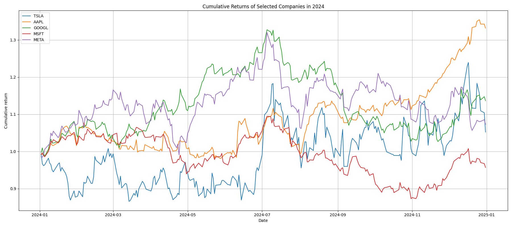
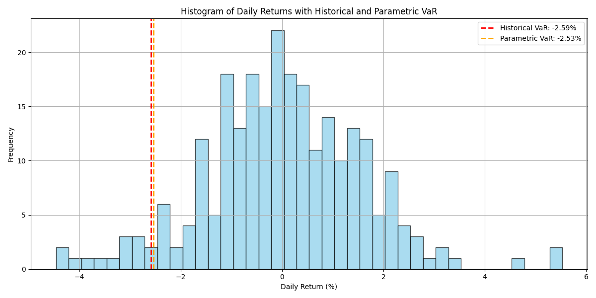

# 📈 Analysis of Tech Stocks (2024)

This report summarizes the performance and risk analysis of selected tech stocks from **January 1, 2024 to January 1, 2025**.  
The companies included are: **TSLA, AAPL, GOOGL, MSFT**, with a separate in-depth analysis for **META**.

---

## 🔁 Cumulative Returns Comparison

**Observations:**
- Apple (AAPL) dipped below 0% multiple times throughout the year but ended with the highest total return of over 33%, making it the top performer in this group.
- Tesla (TSLA) spent most of the first half of the year in negative territory, but managed to close the year with a positive return of around 5%.
- Google (GOOGL) remained positive throughout the year and briefly held the second-best return midway through 2024.
- Microsoft (MSFT) ended the year with a small loss (around -5%), and was the only company in this group to finish in the red.
- Meta (META) fluctuated between 0% and 20% gains during the year, peaking slightly above 30% mid-year, similar to Google. It ended the year with a gain of approximately 7%.
- Most companies showed significant gains or peaks around mid-year

---

## 📊 META: Daily Returns and Value at Risk

**Insights:**
- The histogram of daily returns for META shows a mostly normal distribution centered around 0%.
- There are some strong negative outliers.
- Historical VaR (95% confidence): **~ -2.59%**  
- Parametric VaR (95% confidence): **~ -2.53%**

Value at Risk (VaR) helps quantify the maximum expected loss over a given time period with a specific confidence level — it's a critical measure for financial risk management.

In our case, we computed one-day VaR at a 95% confidence level using two methods:

Historical VaR: 2.59%

Parametric VaR (assuming normal distribution): 2.53%  

This means that with 95% confidence, we expect that META's daily loss will not exceed 2.59% (historical) or 2.53% (parametric) on most trading days.

---

## 📌 Key Notes

- Data range: **2024-01-01 to 2025-01-01**
- Only common dates across all tickers are used for cumulative return calculations.
- Tickers with missing data are skipped.

---

## ✅ Conclusion

This analysis shows how major tech stocks performed over 2024.  
Risk metrics like VaR help highlight the volatility of stocks like META, while the return chart visualizes the relative growth of each company.

Most companies delivered positive returns, with the top performer being Apple (AAPL) at over 33% annual growth. 
Other companies: 
- Google (GOOGL): ~13% gain
- Meta (META): ~7% gain
- Tesla (TSLA): ~5% gain
- Microsoft (MSFT): ~5% loss
